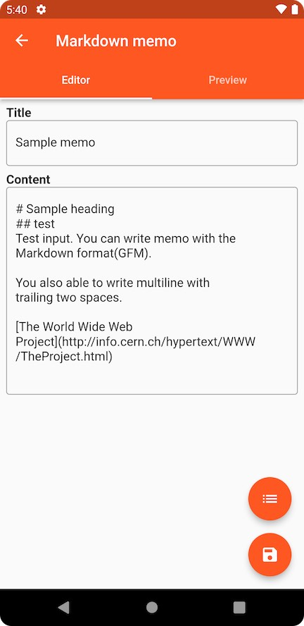
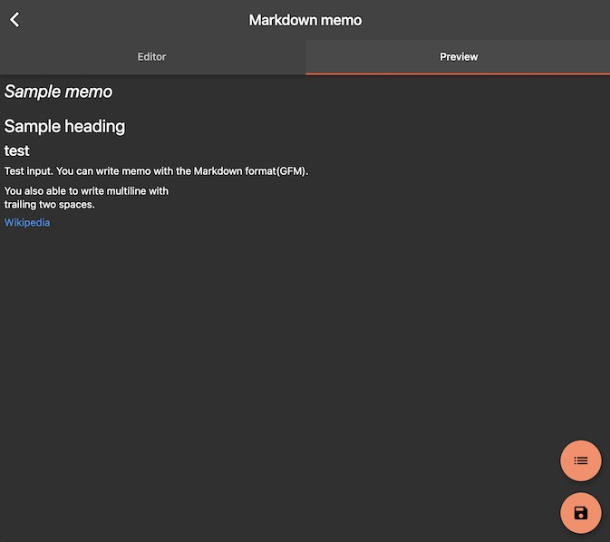

[Japanese](README_ja.md)

# private-markdown-writer
An private markdown writer running on web(maybe android, ios if signed them).

Notes are stored locally only and can be managed without uploading to an external server.

**Editor**

**Preview**

## Build environment construction
1. get dependencies and run localization.
`flutter pub get`

1. run auto code generation
`flutter pub run build_runner build --delete-conflicting-outputs`

## run app on development
### debug
- web: `flutter run -d chrome --web-renderer html`
- Android/iOS: `flutter run -d (your-device-name) --r   elease`

### staging
- web: `flutter run -d chrome --release --web-renderer html`
- Android/iOS: `flutter run -d (your-device-name) --release`

## Release
### web
1. Build app.
`flutter build web --web-renderer html`

2. Deploy `build/web` to your web service.

### other platform
Not yet supported as we do not plan to release it in Google Play/App Store.
