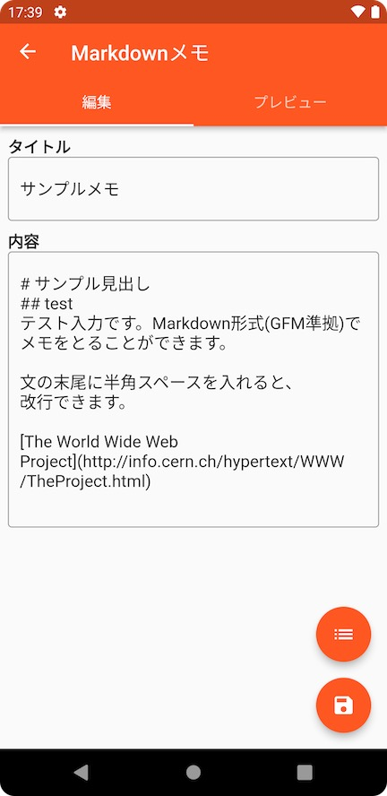
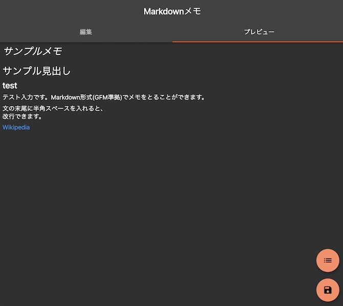

[English](README.md)

-027DFD.svg?logo=flutter&style=flat)

# private-markdown-writer
Web(およびAndroid/iOS等)上で動作するMarkdownメモアプリです。

メモはローカルでのみ保存され、外部サーバにアップロードせず管理することができます。

**エディタ**

**プレビュー**

## ビルド環境の構築
1. 依存ライブラリをインストールおよびローカライゼーションを行います。
`flutter pub get`

1. 自動的に一部コードを生成します。
`flutter pub run build_runner build --delete-conflicting-outputs`

## アプリをローカルで動作させる
### デバッグビルド
- web: `flutter run -d chrome --web-renderer html`
- Android/IOS: `flutter run -d (your-device-name)`

### ステージングビルド
- web: `flutter run -d chrome --release --web-renderer html`
- Android/iOS: `flutter run -d (your-device-name) --release`

## リリース
### Webアプリ
1. アプリをビルドします。
`flutter build web --web-renderer html`

2. `build/web`にビルド済みアプリがあるので、同階層内のファイルをお使いのWebサービス上にアップロードします。

### その他プラットフォーム
Google Play/App Storeでのリリースを予定していないため、未サポートです。
